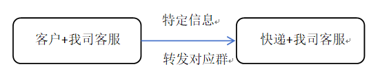

# 业务背景
#### 我司主要业务为云仓，介于快递公司和电商客户的中间环节。目前有一定在仓客户数量，公司客服每天需要接待电商客户反馈的快递拦截改地址等信息，同时将反馈的信息转发给快递公司相关人员处理。为了减少人员时间成本，需要微信群转发软件协助工作。



## 特定信息转发对应群：
### 1、单条信息
申通单号（圆通/中通/邮政/韵达/极兔） 拦截（快递拦截/催件/改地址）

### 2、多条信息
##### ①　申通单号 申通单号 拦截（快递拦截）
##### ②　申通单号 申通单号，快递拦截（快递拦截）
##### ③　申通单号，申通单号 拦截（快递拦截）
##### ④　申通单号 中通单号 邮政单号 拦截（快递拦截）
##### ⑤　申通单号 中通单号 邮政单号 拦截（快递拦截）

```bash
注意：单号和单号直接可能是空格或者回车行或者逗号
```
### 3、特定信息转发对应群指的申通单号转发到申通快递对接群，注意这里存在可能一条信息转发到多个快递群，因为同一个快递公司会有多个网点合作，如果在能够在插件端查询到是哪个网点的，那只需要转发到特定的一个群。

##### 开头数字：[groupdata](groupdata)【77申通】 【73/75/78中通】 【9邮政】   【 3/4 韵达】 【YT圆通】  【JT极兔】  【SF顺丰】
#### 快递拦截词：拦截，召回，
#### 催件：催件，催促，物流不更新
#### 改地址：改地址，新地址，正确地址

## 截单提醒
### 截单时间提醒内容：亲，今日的截单点（15:00）将至，麻烦检查一下系统里是否有未审核的订单，谢谢！
#### 15点截单指定客户：【永新顺为，  永瑞药业，   秋叶源， 顽大夫， 新桥仓， 西洋参山茱萸茶， 裕耀咖啡 ，天宝 ，复真大健康，博尔丹， 锦嘉逸 ，启韵 ，美纳， 金维他， 欣肤源， 益佰年， 仙养元， 志美， 江西中南香料， 随风 ，星臻体育，  华佗馆 ，迈云， jea.love ，脉思德， 溢笙元 ，远臻君， 燃语 ，祖医仙， 裕宝， 李字堂】
#### 16点截单指定客户：【  米炭  ，牛乐 ， 一慕， 开元堂， MW仓  ， 金木玛雅仓】
#### 17点截单指定客户：【文具用品仓， 复真工厂，  本初食品  ，尚腾  ， 橙子母婴】
```bash
注意截单提醒通知 需提前半小时发出通知客户
```